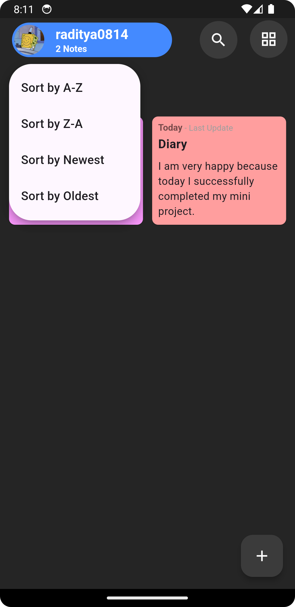

# Notes App

## Project Description
**Notes App** is a simple mobile application for users to create, view, edit, and delete notes. It integrates with Firebase Authentication to allow users to sign in using their Google account. The app also stores notes locally on the device using Hive, a lightweight and fast local database.

## Tech Stack
- **Flutter**: The primary framework used to build the mobile app.
- **Dart**: The programming language used with Flutter.
- **Firebase Authentication**: Used for user authentication via Google accounts.
- **Google Sign-In**: For enabling Google-based user sign-in.
- **Hive**: Local database for offline storage of user notes.
- **SignIn Button**: Provides a UI button for signing in with Google.

## Prerequisites
Before running this project, make sure you have the following installed:
1. **Flutter SDK** - [Download Flutter](https://flutter.dev/docs/get-started/install)
2. **Android Studio or Visual Studio Code** - An IDE supporting Flutter development.
3. **Firebase Project** - Set up a Firebase project and configure it for your app.
4. **Google API Credentials** - Create an OAuth client ID on the Google Cloud Console to enable Google Sign-In.

## Installation
Follow these steps to clone and run the project:

1. Clone this repository to your local machine:
   ```bash
   git clone https://github.com/sibobbbbbb/notes_app.git
   cd notes_app

2. Install the Flutter dependencies:
   ```bash
   flutter pub get
3. Run the app:
   ```bash
   flutter run

## Features
- Google Sign-In Authentication: Users can log in using their Google account.
- CRUD Notes: Users can create, read, update, and delete notes.
- Local Data Storage: Uses Hive to store user notes offline on the device.
- User Profile Management: Displays user information such as profile picture, name, and email after login.
- Logout Functionality: Users can log out and return to the login page. After logging out, users will be prompted to select a Google account when logging back in.

## Screenshot Program
Here are some screenshots of the Notes App:

<div>
   
   
</div>
<div>
   
   
</div>
<div>
   
   
</div>
<div>
   
   
</div>
